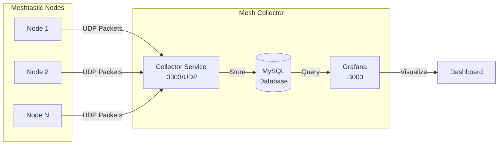
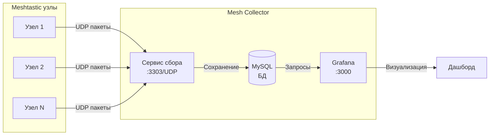

# Mesh Collector

[English](#english) | [Русский](#russian)

---

## English

Mesh Collector is a service for collecting and visualizing packets from LoRa Meshtastic nodes running the [meshtastic-sniffer](https://github.com/sibrat/meshtastic-sniffer) firmware.

### Architecture



### How It Works

1. **Nodes** running meshtastic-sniffer firmware capture LoRa packets and forward them via UDP to the Mesh Collector service
2. **Collector Service** receives packets on port `3303/UDP`, processes them, and stores the data in MySQL
3. **Grafana** provides a pre-configured dashboard for visualizing network activity, node status, and packet statistics

### Quick Start

```bash
docker compose up -d
```

### Services

| Service | Port | Credentials |
|---------|------|-------------|
| Grafana | 3000 | user: `meshtastic`<br/>pass: `meshtastic` |
| MySQL | 3306 | user: `meshrouter`<br/>pass: `meshtastic` |
| Collector | 3303/UDP | - |

### Configuration

Configure your meshtastic-sniffer nodes to send UDP packets to the Mesh Collector's IP address on port `3303`.

---

## Russian

Mesh Collector — сервис для сбора и визуализации пакетов от LoRa Meshtastic узлов с прошивкой [meshtastic-sniffer](https://github.com/sibrat/meshtastic-sniffer).

### Архитектура



### Принцип работы

1. **Узлы** с прошивкой meshtastic-sniffer захватывают LoRa пакеты и пересылают их по UDP в сервис Mesh Collector
2. **Сервис сбора** принимает пакеты на порту `3303/UDP`, обрабатывает их и сохраняет в MySQL
3. **Grafana** предоставляет предварительно настроенный дашборд для визуализации активности сети, статуса узлов и статистики пакетов

### Быстрый старт

```bash
docker compose up -d
```

### Сервисы

| Сервис | Порт | Учётные данные |
|--------|------|----------------|
| Grafana | 3000 | пользователь: `meshtastic`<br/>пароль: `meshtastic` |
| MySQL | 3306 | пользователь: `meshrouter`<br/>пароль: `meshtastic` |
| Collector | 3303/UDP | - |

### Настройка

Настройте ваши узлы с meshtastic-sniffer на отправку UDP пакетов на IP-адрес Mesh Collector на порт `3303`.